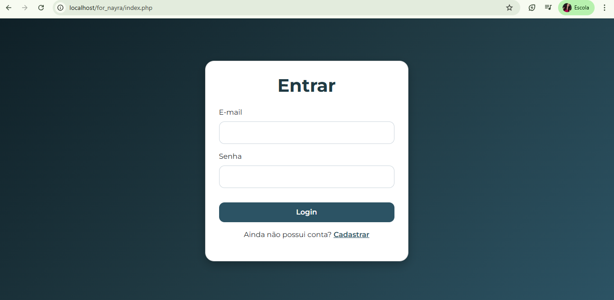
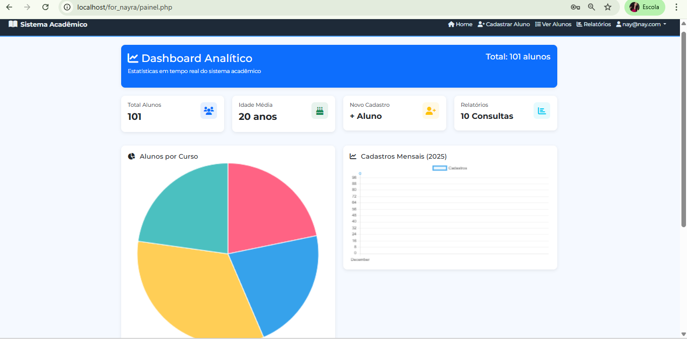
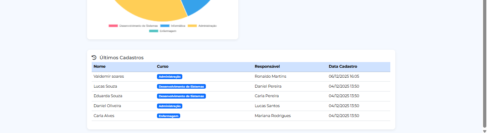
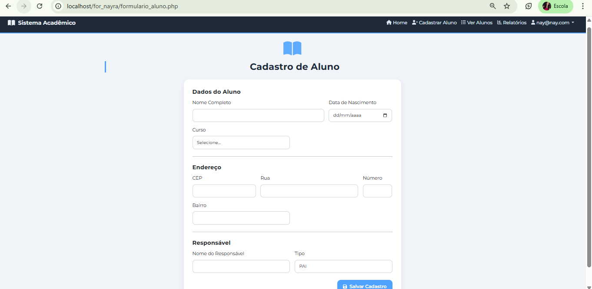
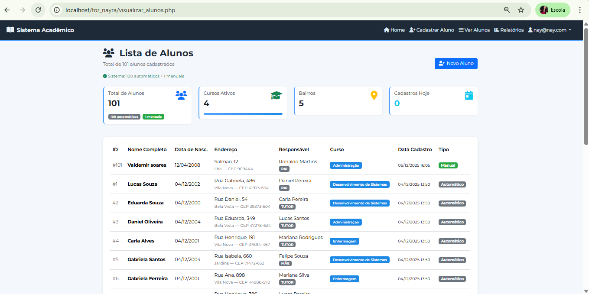
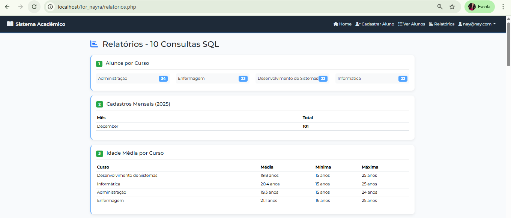
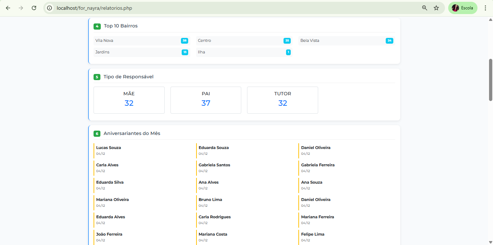
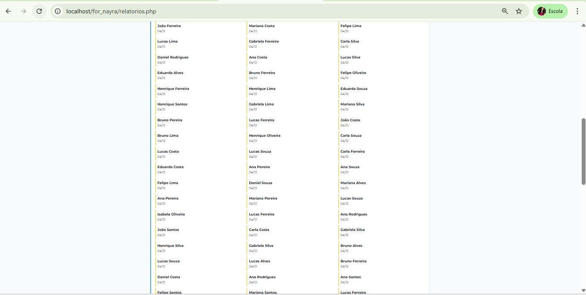
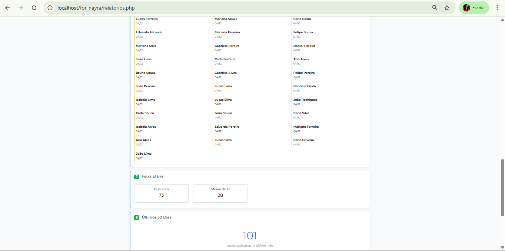
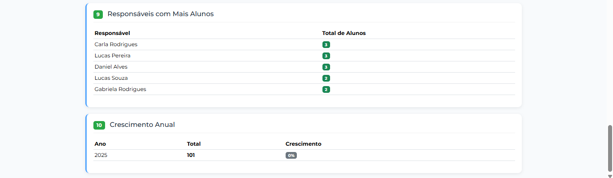

# 🎓 SISTEMA DE GESTÃO DE ALUNOS

**ALUNO:** [Nayra Amanda de Sousa Soares]  
**CURSO:** [Técnico em infórmatica]  
**PROFESSOR:** [Adeilson Sales AragãoI]  
**DISCIPLINA:** [Banco de Dados]

---

## 📖 INTRODUÇÃO

Sistema web desenvolvido em **PHP com MySQL** para gerenciamento de alunos de uma escola. O sistema permite cadastrar, visualizar e analisar dados dos alunos através de relatórios e gráficos.

## ✨ FUNCIONALIDADES PRINCIPAIS

1. **🔐 Login seguro** - Sistema de autenticação
2. **👥 Cadastro de alunos** - Formulário web completo
3. **⚡ 100 alunos automáticos** - População automática do banco
4. **📊 Dashboard com gráficos** - Estatísticas visuais
5. **📈 10 relatórios SQL** - Consultas avançadas
6. **📱 Design responsivo** - Funciona em celular e computador

## 🚀 COMO USAR

### Requisitos:
- XAMPP ou WAMP instalado
- Navegador moderno (Chrome, Firefox)

### Passos:
1. Coloque os arquivos na pasta `htdocs` do XAMPP
2. Inicie o Apache e MySQL no XAMPP
3. Acesse: `http://localhost/nome_da_pasta`
4. Use para login:
   - **Email:** `nay@nay.com`
   - **Senha:** `123`

## 📸 TELAS DO SISTEMA

### 1. TELA DE LOGIN

*Página inicial para acessar o sistema*

### 2. DASHBOARD PRINCIPAL


*Painel com gráficos e estatísticas*

### 3. CADASTRO DE ALUNO

*Formulário para cadastrar novos alunos*

### 4. LISTA DE ALUNOS


*Todos os alunos cadastrados com paginação*

### 5. RELATÓRIOS





*10 consultas SQL diferentes*

## 🔍 10 CONSULTAS SQL IMPLEMENTADAS

### CONSULTA 1: Alunos por Curso
```sql
SELECT curso, COUNT(*) as total FROM alunos GROUP BY curso ORDER BY total DESC
```

### CONSULTA 2: Cadastros por Mês
```sql
SELECT MONTHNAME(data_cadastro) as mes, COUNT(*) as total 
FROM alunos WHERE YEAR(data_cadastro) = YEAR(CURDATE())
GROUP BY MONTH(data_cadastro) ORDER BY MONTH(data_cadastro)
```

### CONSULTA 3: Idade Média por Curso
```sql
SELECT curso, 
       AVG(YEAR(CURDATE()) - YEAR(data_nascimento)) as idade_media,
       MIN(YEAR(CURDATE()) - YEAR(data_nascimento)) as idade_min,
       MAX(YEAR(CURDATE()) - YEAR(data_nascimento)) as idade_max
FROM alunos GROUP BY curso
```

### CONSULTA 4: Top 10 Bairros
```sql
SELECT bairro, COUNT(*) as total FROM alunos 
GROUP BY bairro ORDER BY total DESC LIMIT 10
```

### CONSULTA 5: Tipos de Responsáveis
```sql
SELECT tipo_responsavel, COUNT(*) as total 
FROM alunos GROUP BY tipo_responsavel
```

### CONSULTA 6: Aniversariantes do Mês
```sql
SELECT nome_completo, data_nascimento 
FROM alunos WHERE MONTH(data_nascimento) = MONTH(CURDATE())
ORDER BY DAY(data_nascimento)
```

### CONSULTA 7: Faixa Etária
```sql
SELECT 
    CASE 
        WHEN YEAR(CURDATE()) - YEAR(data_nascimento) < 18 THEN 'Menor de 18'
        WHEN YEAR(CURDATE()) - YEAR(data_nascimento) BETWEEN 18 AND 25 THEN '18-25 anos'
        WHEN YEAR(CURDATE()) - YEAR(data_nascimento) BETWEEN 26 AND 35 THEN '26-35 anos'
        ELSE 'Maior de 35'
    END as faixa_etaria,
    COUNT(*) as total
FROM alunos GROUP BY faixa_etaria
```

### CONSULTA 8: Últimos 30 Dias
```sql
SELECT COUNT(*) as total FROM alunos 
WHERE data_cadastro >= DATE_SUB(NOW(), INTERVAL 30 DAY)
```

### CONSULTA 9: Responsáveis com Mais Alunos
```sql
SELECT nome_responsavel, COUNT(*) as total_alunos 
FROM alunos GROUP BY nome_responsavel 
HAVING COUNT(*) > 1 ORDER BY total_alunos DESC LIMIT 5
```

### CONSULTA 10: Crescimento Anual
```sql
SELECT YEAR(data_cadastro) as ano, COUNT(*) as total
FROM alunos GROUP BY YEAR(data_cadastro) ORDER BY ano
```
ESTRUTURA DO PROJETO
for_nayra/
│
├── 📄 index.php              # Página de login
├── 📄 login.php              # Processa login
├── 📄 painel.php             # Dashboard com gráficos
├── 📄 visualizar_alunos.php  # Lista todos alunos
├── 📄 formulario_aluno.php   # Cadastro manual
├── 📄 processa_cadastro.php  # Salva aluno no banco
├── 📄 relatorios.php         # 10 consultas SQL
├── 📄 inserir_alunos.php     # Cria 100 alunos automáticos
├── 📄 conexao.php            # Conexão com banco
├── 📄 verifica_login.php     # Protege páginas
├── 📄 navbar.php             # Menu de navegação
│
├── 📷 login.png              login.png
├── 📷 dashboard.png          dashboard.png
├── 📷 cadastro.png           cadastro.png

├── 📷 visualizar.png             visualizar.png
                            visualizar2.png
 
 
 
                              
├── 📷 relatorios.png         relatorios.png
                               relatorios2.png
                               relatorios3.png
                               relatorios4.png
                               relatorios5.png
 
                                  
│
└── 📄 README.md              # Este arquivo (capa do trabalho)


🛠️ TECNOLOGIAS UTILIZADAS
PHP 7.4+ - Linguagem backend

MySQL 5.7+ - Banco de dados

Bootstrap 5 - Design da interface

Chart.js - Gráficos no dashboard

JavaScript - Interatividade

HTML5/CSS3 - Estrutura e estilo

📝 DETALHES TÉCNICOS
Banco de Dados:
Tabela users: Armazena usuários do sistema

Tabela alunos: Armazena todos os dados dos alunos

100 registros automáticos: Criados no primeiro acesso

Segurança:
Senhas criptografadas com MD5

Sessões PHP para controle de acesso

Proteção contra SQL Injection